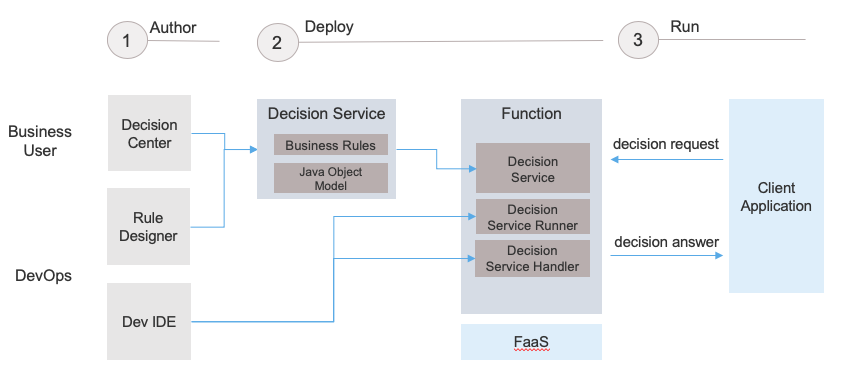

# Decisions in Function as a Service

This repository demonstrates the deployment and invocation of decision services developed with IBM Operational Decision Manager in a Function as a Service platform. IBM ODM empowers you to automate your decision making as a function in a FaaS platform.

By leveraging the authoring, validation and governance capabilities of ODM you obtain an executable artifact for the decision service. This artifact is then incorporated into a function. And this function is deployed and run at scale in the FaaS platform.

The following project describes this approach on public cloud FaaS environments: 

- [miniloan in AWS Lambda](miniloan-aws-lambda/README.md): Shows how to deploy and invoke a simple loan application in AWS Lambda

The Decision Service projects are available at [Decision service projects](decision-service-projects)
